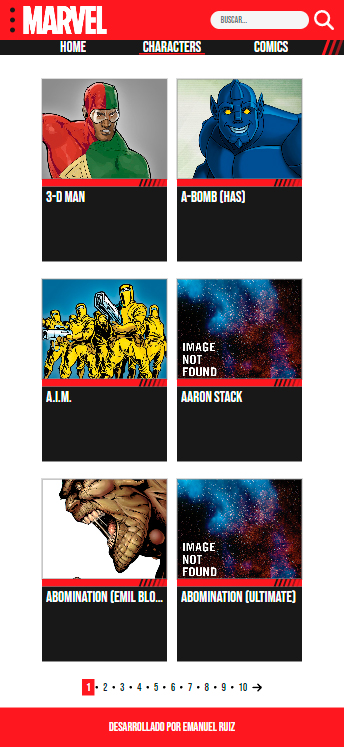

# Marvel Website using Marvel API

This is a website that consumes the [Marvel API](https://developer.marvel.com/). Shows a list of characters, comics and allows to search for both of them. Also displays a modal and a page for every single character and comic. 

## Table of contents

- [Overview](#overview)
  - [Screenshot](#screenshot)
  - [Links](#links)
- [My process](#my-process)
  - [Built with](#built-with)
  - [Useful resources](#useful-resources)
- [Running locally](#running-locally)
- [Author](#author)

## Overview

### Screenshot



### Links

- Website: [Website on Netlify](https://marvel-emanuel-ruiz.netlify.app/)
- Repository: [Github](https://github.com/ruizemanuel/marvel)

## My process

### Built with

- React JS
- React Router DOM
- CSS custom properties
- React Boostrap
- Font Awesome Icons

### Useful resources

- [Chat GPT](https://chat.openai.com/chat) - This helped me speed up the development of the project by asking specific questions about certain code needs.
- [WhatTheFont](https://www.myfonts.com/pages/whatthefont) - This is a great AI tool to find the font from an image

## Running locally

Go to [Developer Marvel](https://developer.marvel.com/) and create an account

Take note of your public key and your private key

For example, if your public key is "1234" and your private key is "abcd" you could construct a valid call as follows: http://gateway.marvel.com/v1/public/comics?ts=1&apikey=1234&hash=ffd275c5130566a2916217b101f26150 (the hash value is the [md5](https://www.md5hashgenerator.com/) digest of 1abcd1234 (ts+privateKey+publicKey))

Clone the repo or download it as ZIP then for install the needed dependencies run on the console:

```
npm init
```
and in order to execute the app run:
```
npm start
```


## Author
- Github - [@ruizemanuel](https://github.com/ruizemanuel)


